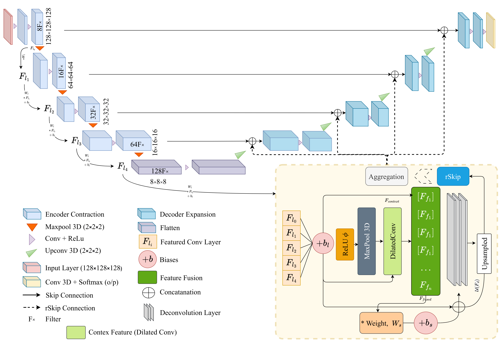

# ReFRM3D: A Radiomics-enhanced Fused Residual Multiparametric 3D Network with Multi-Scale Feature Fusion for Glioma Characterization

## Overview
This repository contains the official *Keras* implementation of our proposed model **ReFRM3D**.  
ReFRM3D is a radiomics-enhanced fused residual multiparametric 3D network designed for accurate and computationally efficient glioma segmentation and characterization.

Our framework integrates:

- Multi-scale feature fusion  
- Hybrid upsampling strategy  
- Extended residual skip connections  
- Radiomics-guided tumor classification  

<p align="center">
  <!-- Replace with your architecture image link -->
  
</p>

---

## Major Contributions:

> **Radiomics-Enhanced Segmentation:** Combines deep segmentation features with handcrafted radiomic descriptors.

> **Fused Multi-Scale Feature Fusion (FMFF):** Captures both global context and fine-grained tumor structures.

> **Hybrid Upsampling with Residual Integration:** Reduces interpolation artifacts and preserves spatial detail.

> **Residual Skip Mechanism (rSkip):** Enhances feature propagation and stabilizes training.

> **Efficient 3D Processing Pipeline:** Brain isolation, voxel normalization, and slice range optimization reduce computational overhead.

---

## Parent Directories

```
├── data/
├── model/
├── preprocessing/
├── figs/
└── radiomics
```

Detailed usage instructions will be updated soon. The model weight can be accessed from [here](https://drive.google.com/file/d/1qPWqe9vT5AqlFHAqali6V5TKERSdpq5R/view?usp=sharing)

---

## Datasets

The model is evaluated on the publicly available **BraTS benchmark datasets**:

- BraTS2021 (used for training + eval)  
- BraTS2019 (eval)
- BraTS2020 (eval)
- BraTS-Africa (cross-validation and generalization)

Out of the 4 modalities, we used the following 3 modalities (skipped T1) for our multi-parametric 3D model:

- T1ce  
- T2  
- FLAIR  

---

## Citation

The manuscript was submitted to Knowledge-Based System on 10 May, 2025, and is currently under review. The preprint can be cited with the follwoing:

```bibtex
@article{rahman2025refrm3d,
  title={ReFRM3D: A Radiomics-enhanced Fused Residual Multiparametric 3D Network with Multi-Scale Feature Fusion for Glioma Characterization},
  author={Rahman, Md Abdur and Raiaan, Mohaimenul Azam Khan and Abian, Arefin Ittesafun and Zhang, Yan and Jonkman, Mirjam and Azam, Sami},
  journal={arXiv preprint arXiv:2512.22570},
  year={2025}
}
```